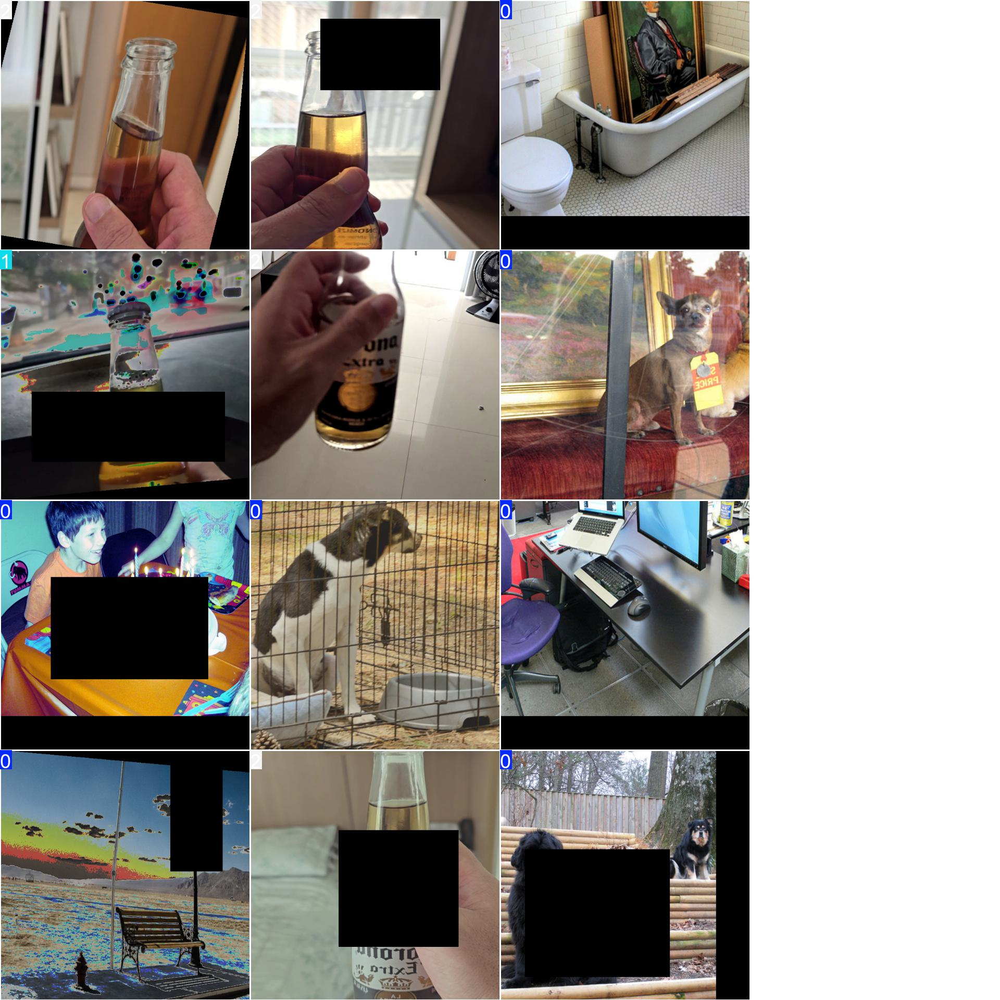
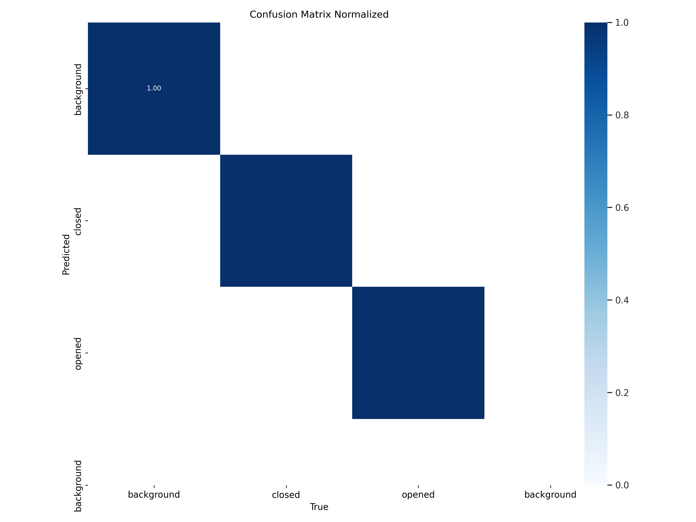
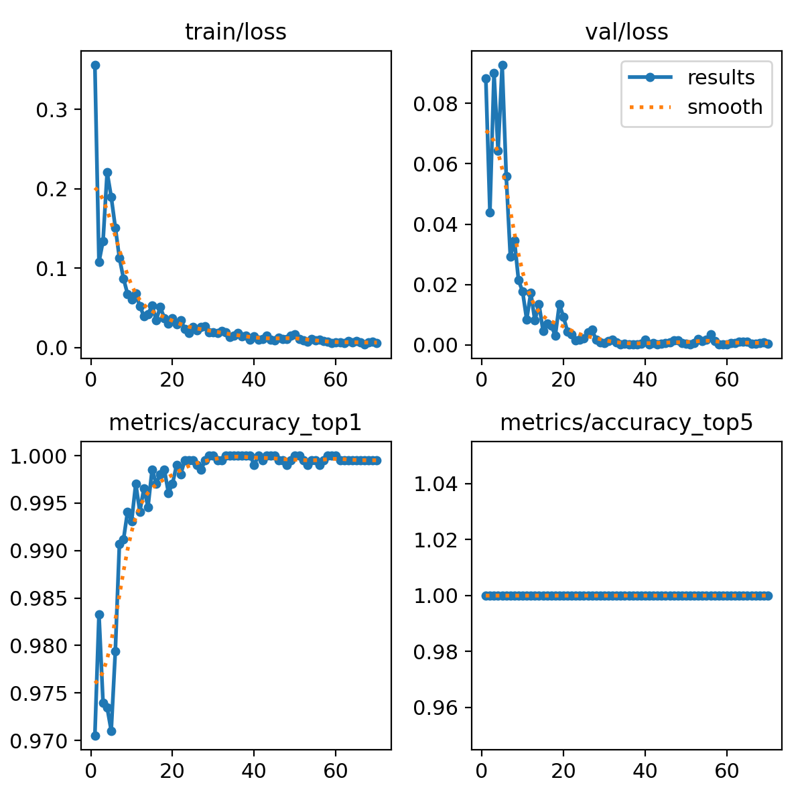
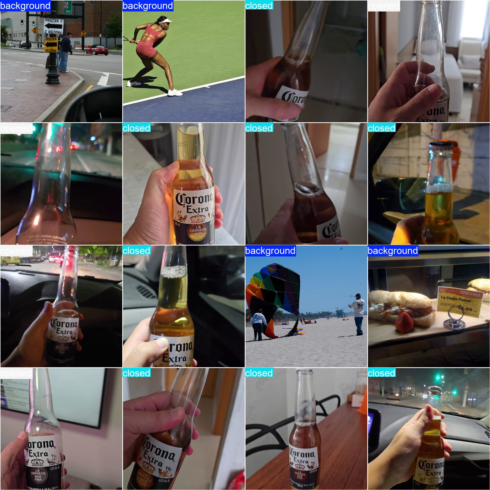

# Overview

This repository contains a Beer Bottle Status Classification application. Its main purpose is to determine whether a beer bottle is **opened**, **closed**, or **background** (neither) based on an image input. The solution is built with Flask for the API layer and leverages Ultralytics YOLOv11 for the underlying machine learning model.

### Key Parts
* **Data and Model**: Trained on a curated dataset (user-provided, synthetic, or a combination) of images labeled as either "open" or "closed".
* **Flask API**: Serves a /classify endpoint that accepts an image and returns a JSON response with the predicted status and confidence score.
* **Scalability**: Designed to support high throughput using container orchestration, load balancing, caching, and autoscaling concepts.


## Project Structure


```bash
deliverables
├── app.py                   # Main Flask application with the /classify endpoint
├── .comet.config            # Comet ML configuration 
├── dataset/                 # Original dataset of beer bottle images
├── Dockerfile               # Docker configuration for containerization
├── .dockerignore            # Specifies files to ignore in Docker build
├── model_files/             # Directory for trained model, pretrained model, and config file
├── processed_dataset/       # Pre-processed dataset (without background as a class)
├── processed_dataset_v2/    # Second version of the processed dataset (with background as a class)
├── README.md                # Project documentation
├── requirements.txt         # Python dependencies
├── runs/                    # Ultralytics YOLO training results
├── scripts/                 # Supporting scripts (preprocessing, training, utils)
├── static/                  # Frontend HTML/JS/CSS file
└── venv/                    # Python virtual environment (not committed to Git)
```

## Setup Instructions

1. **Clone the Repository**
```bash
   git clone https://github.com/Bardhitoo/beer-bottle-classifier.git
   cd beer-bottle-classifier
```

2. **Create and Activate a Virtual Environment (Option but Recommended)**
```bash
    python -m venv venv
    source venv/bin/activate  # On Linux/Mac
    venv\Scripts\activate     # On Windows
```

3. **Install Dependencies**
```bash
    pip install -r requirements.txt
```

4. **Run the Application**
```bash
    python app.py
```

By default, Flask will start the server at ```http://0.0.0.0:5000```. 

5. **Access the Web Interface**
   
Open a web browser ancurl -X POST -F "file=@/path/to/your/image.jpg" http://localhost:5000/classify navigate to: 

```bash
http://localhost:5000/
``` 

This will load the index.html from the `static/` directory, where you can upload an image of a beer bottle and view the classification result.   


## Usage
Image Classification
1. **Using the Frontend Interface (locally)**
    * Navigate to `http://localhost:5000/`.
    * Upload an image of a beer bottle (JPEG, JPG, or PNG).
    * Click the "Classify" button.
    * View the classification result and confidence score on the page.

2. **Using the Frontend Interface (cloud - AWS/Fargate)**
    * Navigate to `http://18.133.250.107:5000/`.
    * Upload an image of a beer bottle (JPEG, JPG, or PNG).
    * Click the "Classify" button.
    * View the classification result and confidence score on the page.

3. **Using Command Line w cURL**

```bash
curl -X POST -F "file=@/path/to/your/image.jpg" http://localhost:5000/classify
```
This command uploads an image and retrieves the classification result in JSON format.


## Docker Instructions

Containerizing the application ensures a consistent environment across different deployment stages.

1. **Build the Docker Image**

```bash 
docker build -t beer-classifier .
```

2. **Run the Docker Container**

```bash
docker run -p 5000:5000 beer-classifier
```

3. **Access the Application**

Open a web browser and go to `http://localhost:5000` to use the service.


## Dataset & Model Notes

### **Dataset:**
* Located in the dataset/ directory.
* Consists of images labeled as:

    0. **"background"** (These 5000 arbitrary images from the [Common Objects in COntext (COCO) dataset](https://cocodataset.org/#home
)
    1. **"opened"** ), denoting ***background/ no beer in image***
    2. **"closed"**

* Additional pre-processed datasets are available in `processed_dataset/` (without `background`) and `processed_dataset_v2/` (with `background`).

### **Model:**
* Utilizes the [`YOLOv11m-cls.pt`](https://github.com/ultralytics/ultralytics)(: latest) classification architecture from [Ultralytics](https://www.ultralytics.com/).
* Trained model weights are stored in model_files/ or within the runs/ directory after training.
* To train the model, refer to the scripts in the `scripts/` directory.

### **Data Augmentation:**
* Applied techniques include random resizing, color jitter, flipping, and more to improve model robustness. Ultralytics has predefined augmentation options that are intergrated in runtime during model training. Those configurations can be found in `model_files/config.yaml`




### **Model Performance:**



#### **Predictions**


#### **Ground Truth**


## API Documentation

### **Endpoint:** `/classify`

### **Description:**

Accepts an image via a POST request and classifies the beer bottle as either **open**, **closed**, or **background**. Returns a JSON response with the classification result and confidence score.

**URL:**

`POST /classify`

**Headers:**

`Content-Type: multipart/form-data`

**Body Parameters (Form Data):**

`file`: The image file to be classified (supported formats: JPEG, JPG, PNG).

**Example cURL Request:**

```bash
curl -X POST -F "file=@/path/to/beer_bottle.jpg" http://localhost:5000/classify
```

**Success Response**

- **Code:** `200 OK`
- **Content:**
```json
    {
    "Bottle_status": "opened",
    "Confidence": 0.95
    }
```
- **Bottle_status**: Indicates whether the bottle is `"opened"`, `"closed"`, or `"background"` (which denotes no image of beer).
- **Confidence**: A floating-point value between 0.0 and 1.0 representing the model's confidence in the prediction.

### **Error Responses** 
#### **Code:** `400 Bad Request`
- **Reason:** No file, empty filename, or incorrect file format provided.
- **Note:** This adds an extra layer of security beyond file extension checking.
    - File Format Validation: Only files with .png, .jpg, or .jpeg extensions are accepted.
    - MIME Type Validation: Ensures the file content matches the expected image MIME types.
    - Secure Filename: Sanitizes the uploaded filename to prevent directory traversal attacks.
    
- **Content:** 

```json
    {
      "error": "No file provided."
    }
```

#### **Code:** `413 Uploaded file is too large.`
* **Reason:** To prevent denial-of-service (DoS) attacks via large file uploads. Maximum size allowed is 16MB.
* **Content:**

```json
    {
        "error": "File too large."
    }
```

#### **Code:** `429 Rate limit exceeded.`
* **Reason:** Prevent abuse by limiting the number of requests a user can make within a certain timeframe.
* **Content:**
```json
    {
        "error": "Rate limit exceeded."
    }
```

#### **Code:** `500 Internal Server Error`
* **Reason:** Model inference error or other internal issues.
* **Content:**
```json
    {
        "error": "Model inference error."
    }
```

## Sample Response

Below is an example of a successful JSON response returned by the API:
```json
{
  "bottle_status": "opened",
  "confidence": 0.85
}
```
- **bottle_status:** The predicted status of the beer bottle.
- **confidence:** The confidence level of the prediction, ranging from 0.0 (no confidence) to 1.0 (complete confidence).
 

## High-Throughput Scenarios (Locally)
After conducting load tests both **with** and **without** rate limiter using **Locust**. 

### Without Rate Limiter
```yaml
POST /classify: 2047 requests, 0 fails
Average Response Time: 13,820 ms
Request Rate: 51.70 req/s
```

**Behavior**:
* **High Response Times**: The average response time is approximately **13.8 seconds**, indicating that the server is heavily overloaded.
* **No Failures**: Despite high latency, all requests were processed successfully.


### With Rate Limiter

```yaml
POST /classify: 6793 requests, 6743 fails (99.26%)
Average Response Time: 715 ms
Failures: 429 Too Many Requests (6654), ConnectionResetError (89)
```

**Behavior**:
* **Moderate Response Times**: The average response time drops significantly to **715 ms**, indicating better performance for allowed requests.
* **High Failure Rate**: 99.26% of requests were rate-limited, showcasing effective throttling to protect the API from overload.
* **Connection Resets**: A small number of connection reset errors occurred, which may require further investigation.


--------

# Suggested Infrastructure   

## Suggested Plan for Load Balancing, Caching, and Scaling

To handle 1,000 RPS effectively, there needs a robust infrastructure strategy for load balancing, caching, and scaling. Below is a high-level plan tailored for AWS environments, leveraging services like AWS ALB, Amazon ElastiCache, and Amazon ECS/Fargate.

Distribute incoming traffic evenly across multiple instances to ensure no single instance becomes a bottleneck.
1. **AWS Application Load Balancer (ALB)** Operates at Layer 7 (Application Layer), allowing for content-based routing. It automatically handles varying traffic loads without manual intervention. Also it distributes traffic across multiple Availability Zones (AZs) for fault tolerance. And it supports A/B testing, blue/green deployments. AWS ALB integration with ECS seamlessly to distribute traffic across containers.

2. **Caching Strategies**
Reduce latency and offload repetitive tasks by storing frequently accessed data closer to the application or users. The recommended tool will be Amazon ElastiCache (Redis). This tool caches results for frequently requested images or classification results to reduce model inference load. It enables to implement distributed rate limiting using Redis to track and control the number of requests per user.

3. **Scaling the Application**
Dynamically adjust the number of application instances to handle varying traffic loads while optimizing costs. For this application **Horizontal Scaling** would be fitting, as it enables increasing the number of application instances (containers) to distribute the load. This is currently implemented with AWS ECS/ Fargate. More auto-scaling policies would have to be defined to maintain a specified metric (e.g., CPU utilization at 70%). This enables the distribution of loads across more instances, reducing the impact of individual failures and it scales up only when needed, optimizing resource usage.

## Suggested Database Design
For this problem, the proposed database would be a combination of **PostgreSQL** for structured logging and **AWS S3** for secure and scalable image storage.  


#### Tables
PostgreSQL efficiently handles large volumes of structured data, ideal for logging and querying extensive request information. Moreover, with replication and automated backups, PostgreSQL ensures high availability and data durability. Some of the proposed data to be logged can be found here.

#### 1. Users

| Column      | Data Type | Constraints              | Description                  |
|-------------|-----------|--------------------------|------------------------------|
| user_id     | UUID      | Primary Key              | Unique identifier for users  |
| username    | VARCHAR   | Not Null, Unique         | Username of the user         |
| email       | VARCHAR   | Not Null, Unique         | Email address of the user    |
| created_at  | TIMESTAMP | Not Null, Default NOW()  | Account creation timestamp   |
 (and other demographic data)

#### 2. Requests

| Column       | Data Type | Constraints                     | Description                                      |
|--------------|-----------|---------------------------------|--------------------------------------------------|
| request_id   | UUID      | Primary Key                     | Unique identifier for each request               |
| user_id      | UUID      | Foreign Key (Users.user_id)     | Identifier for the requesting user               |
| model_version| UUID      |                                 | Identifier for the model version                 |
| timestamp    | TIMESTAMP | Not Null, Default NOW()         | Time when the request was made                   |
| ip_address   | INET      | Not Null                        | IP address of the requester                      |
| metrics      | JSONB     |                                 | Additional request metrics                       |
| image_id     | UUID      | Unique, Not Null                | Unique identifier for the associated image       |

#### 3. Classifications

| Column            | Data Type | Constraints                         | Description                               |
|-------------------|-----------|-------------------------------------|-------------------------------------------|
| classification_id | UUID      | Primary Key                         | Unique identifier for each classification |
| request_id        | UUID      | Foreign Key (Requests.request_id)   | Associated request identifier            |
| class_name        | VARCHAR   | Not Null                            | Name of the classified category           |
| confidence_score  | DECIMAL   | Not Null                            | Probability score of the classification   |

### Amazon S3 for Image Storage

All uploaded images are securely stored in Amazon S3 buckets, providing a highly scalable, durable, and cost-effective solution for managing image data.

- **Storage Strategy:**
  - **Image ID:** Each image is assigned a unique `image_id`.
  - **Organization:** Images are stored with `image_id` as the key for straightforward retrieval.

- **Accessing Images:**
  - **By Image ID:** Retrieve images using their unique `image_id`.
  - **By Date:** Query images based on the upload date for organized access.


## Suggested Monitoring and Metrics

To ensure our API remains reliable, performant, and scalable, key performance indicators (KPIs) need to be tracked - this can be done by utilizing AWS CloudWatch for monitoring.

### Key Performance Indicators (KPIs)

1. **Response Time**: time taken to process and respond to a request.

2. **Uptime**: Percentage of time the API is operational and accessible.

3. **Error Rate**: Percentage of failed requests out of total requests.

4. **Throughput**: Number of requests processed per second (RPS).

5. **Resource Utilization**: Usage levels of CPU and memory.

### Monitoring Tool

**AWS CloudWatch**

The recommended tool to utilize is **AWS CloudWatch** to monitor and visualize the predefined KPIs, set up alarms, and gain insights into the application's performance.

- **Features:**
  - **Metrics Collection:** Automatically gathers metrics like CPU usage, memory utilization, and network traffic from AWS services.
  - **Dashboards:** Create custom dashboards to visualize real-time metrics.
  - **Alarms:** Set thresholds to trigger notifications or auto-scaling actions.
  - **Logs Integration:** Aggregate and analyze application logs for troubleshooting.

## Suggested Security Measures

Securing the API is paramount to protect user data, ensure privacy, and maintain the integrity of the service. 

### Authentication

1. **JWT (JSON Web Tokens) Authentication**: Utilizes JWTs to securely transmit information between clients and the server. Each token contains encoded user information and is signed to ensure its authenticity.

2. **OAuth for Google Login**: Implements OAuth 2.0 protocol to allow users to authenticate using their Google accounts, leveraging Google’s secure authentication mechanisms.

3. **Additional Security**
    - TLS Encryption: SSL termination at the load balancer.
    - WAF (Web Application Firewall): Protects against common web exploits.
    - Rate Limiting: Throttles high-volume clients.
    - IAM Roles: Restricts container task privileges to only required AWS resources.


- Note: Image sanitation and image validation have already been implemented in the current implementation of code.

## AWS Infrastructure Diagram

Below is a high-level description of the deployed infrastructure in AWS for this project: *Beer Bottle Status Classification* service in a scalable environment that can handle high throughput and remain fault-tolerant. The design choices balance performance, reliability, and ease of deployment. 

                    +-------------------------+
                    |          Users          |
                    +------------+------------+
                                 |
                                 v
                        (HTTPS / REST API)
                                 |
                       +---------+---------+
                       |   AWS ALB/ELB     |  <=  (Note: Can be developed for A/B Testing different models based on demographic user information.
                       +---------+---------+       It is not currently a part of the infrastructure.)
                                 |
                  +--------------+--------------+
                  |                             |
                  v                             v
          +---------------+             +---------------+
          |   Container   |  ... (N)    |   Container   |
          | (Flask + YOLO)|             | (Flask + YOLO)|   
          +-------+-------+             +-------+-------+
                  |                             |
                  ------------ (ECS) ------------ <=  Used for auto-scaling based on demand vCPU and Memory demand. 
                  |
                  +--------------+
                                 v
                        +---------------+
                        |  GPU-enabled  |   <= (Note: If needed for heavier compute)
                        |    Instances  |
                        +---------------+


            +------------------------------------------------------------+
            |                    Shared Services                         |
            | +-----------------------+     +--------------------------+ |
            | |  Redis / ElastiCache  |     |     Database w/ PostGres | |
            | | (Caching / Rate Limit)|     |     (Logs, metadata)     | |
            | +-----------------------+     +--------------------------+ |
            | +-----------------------+     +--------------------------+ |
            | |   Central Logging     |     |        S3 volume for     | |
            | |    w /CloudWatch      |     |       (Storing images)   | |
            | |   (vCPU & memory      |     +--------------------------+ |
            | |      monitoring)      |                                  |
            | +-----------------------+                                  |
            +------------------------------------------------------------+

## Potential Use Cases in Production Environments
Below are some potential use cases where this solution can be effectively deployed in a production environment:

### 1. **Automated Image Tagging for Digital Asset Management** 
Automatically categorize and tag large volumes of images to streamline digital asset management systems.

### 2. **Quality Control in Manufacturing**
Inspect products on assembly lines by identifying defects or inconsistencies in real-time through image analysis.

